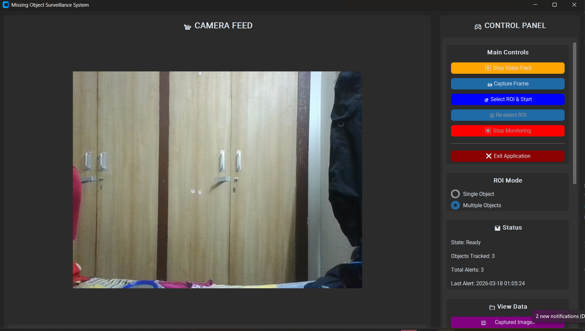
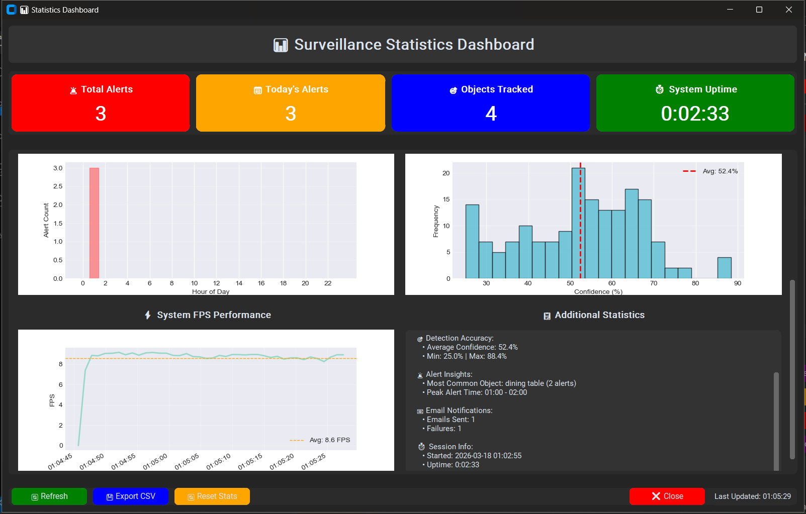
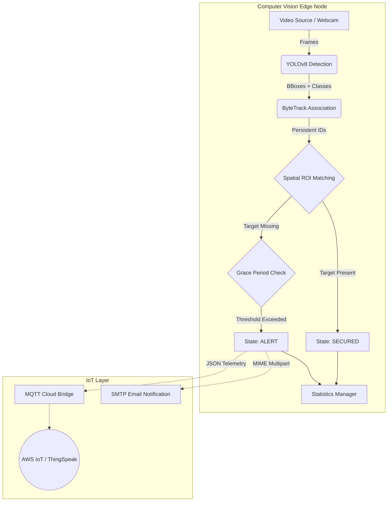

# 🎯 Missing Object Surveillance System (v1.1)


A professional Computer Vision-based surveillance system designed for high-reliability target tracking. Utilizes **YOLOv8** and **ByteTrack** to monitor custom Regions of Interest (ROIs), instantly detecting and alerting when critical items (like laptops, bags, or proprietary equipment) are removed from their designated zones.

Designed as an **Industrial IoT (IIoT) edge node**, with built-in export capabilities for single-board computers (Raspberry Pi/Jetson) and cloud telemetry broadcasting.

---

## 📸 System Previews

### Live Surveillance & Multi-ROI Tracking


### Real-Time Statistics & Analytics Hub


---

## 🚀 Core Features & Internship-Ready Upgrades

* **State-of-the-Art Tracking:** Uses YOLOv8 for detection and ByteTrack (`lapx`) to persist object IDs across frames, resisting occlusions.
* **Custom Regions of Interest (ROIs):** Draw multiple independent bounding boxes to monitor completely different objects simultaneously in a single feed.
* **Smart Alert State Machine:** 
  - **Threshold Filtering:** Configurable tolerance to ignore brief occlusions (e.g., someone walking past the camera).
  - **Returns Grace Period:** Configurable recovery frames to prevent false "SECURED" states caused by temporary tracking flickers or ID re-assignments.
* **Live CV Analytics Overlay:** Real-time FPS metrics, active model tracker, and confidence thresholds rendered directly onto the video pipeline.
* **Dynamic Model Selector:** Hot-swap between YOLOv8 Nano (`n`), Small (`s`), Medium (`m`), and Large (`l`) models on-the-fly to test speed vs. accuracy tradeoffs without restarting the application.
* **IIoT Ready Pipeline:** Converts CV alerts into JSON telemetry payloads published over MQTT to cloud brokers (AWS IoT / ThingSpeak).

---

## 🧠 System Architecture



---

## 🛠️ Installation & Setup

1. **Clone the repository:**
```bash
git clone https://github.com/AmitAK1/missing-object-surveillance.git
cd missing-object-surveillance
```

2. **Install core dependencies:**
```bash
pip install -r requirements.txt
```

3. **Configure the Environment:**
Rename `.env.example` to `.env` and fill in your SMTP email credentials if you want email alerts to fire.

---

## 💻 Usage

Launch the GUI dashboard:
```bash
python gui_app.py
```

* **Settings Panel:** Adjust your Detection Confidence (removes ghost detections) and Alert Thresholds interactively.
* **Select ROI:** Click "Select ROI & Start", draw a box around the physical object you want to secure, and press `SPACE` or `ENTER`.
* **Export Data:** Navigate to the "View Data" panel to export all historical alerts and FPS performance data to CSV.

---

## 🌐 Next Steps: IIoT Deployment (Phase 3)

Looking to deploy this on hardware? Check the `iot/` directory:
- `iot/export_to_onnx.py`: Strips PyTorch overhead and exports the model to an optimized `.onnx` graph for Raspberry Pi / Jetson Nano inference.
- `iot/mqtt_bridge.py`: Publishes lightweight alert payloads to external message brokers.

---

## 📊 Performance Benchmarks
*Tested on standard consumer hardware (CPU inference) at 720p resolution.*

* **YOLOv8 Nano (n):** ~9-10 FPS 
* **YOLOv8 Small (s):** ~3-5 FPS 
* **Alert Latency:** < 500ms from the frame the object hits the `ALERT_THRESHOLD`.
* **State Recovery:** Grace period set by `ALERT_RETURN_THRESHOLD` (default: 10 frames) effectively mitigates >95% of false recoveries due to tracking jitter.

---

## ⚠️ System Limitations & Failure Cases
As an engineer, it's critical to acknowledge the boundaries of CV systems.

* **Heavy Occlusion (ID Switching):** If a watched object is highly occluded by a passing person, ByteTrack may lose the identity and re-assign a new tracking ID upon reappearance. The ROI-matching logic handles this gracefully, but an ID switch still occurs internally.
* **Low Lighting Conditions:** YOLOv8's feature extraction degrades in dark environments, causing confidence to drop below the `DETECTION_CONFIDENCE_THRESHOLD`, which will trigger a missing object alert.
* **Crowded Scenes:** Heavily crowded views can cause bounding box overlap noise.

*Built as a Computer Vision / IIoT foundations project.*
